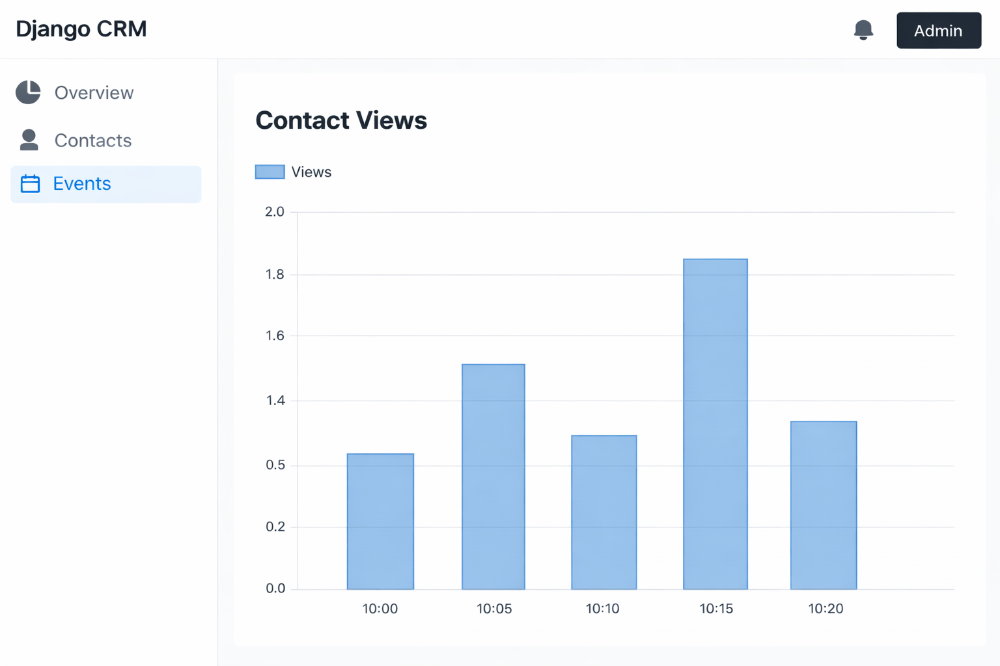
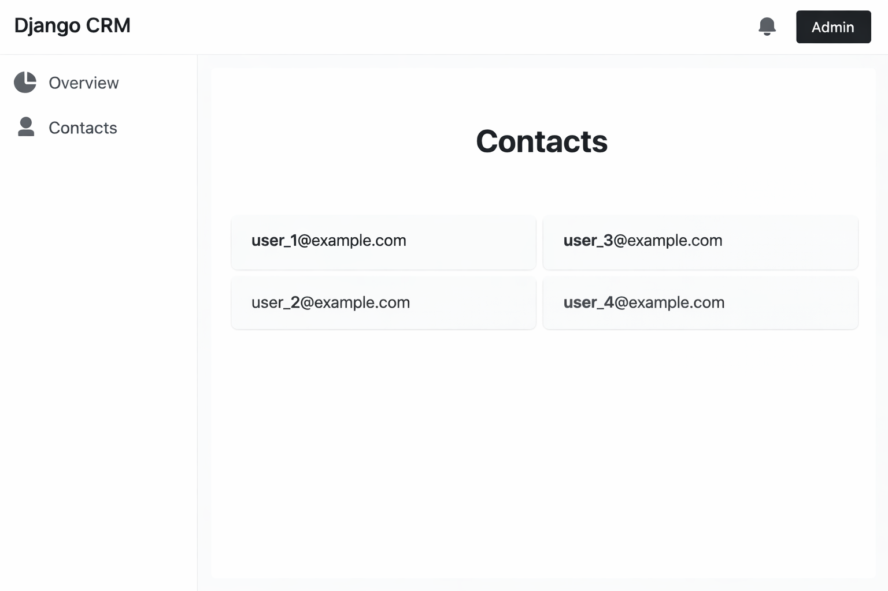

# 📊 Contact Analytics Platform

A **Django-based Contact Analytics & Event Tracking Platform** that allows users to manage contacts, track interaction events, and analyze engagement patterns.

The system integrates external APIs and records events using a scalable backend architecture.

---

# 🚀 Features

* Contact Management System
* Event Tracking Engine
* Dashboard Analytics
* Google Contacts Integration
* Secure Authentication
* Tailwind CSS UI
* Modular Django Architecture

---

# 🛠 Tech Stack

Backend
Python, Django

Database
PostgreSQL

Frontend
HTML, Tailwind CSS

APIs
Google OAuth
Google People API

Tools
Git, GitHub, Docker

---

# 📁 Project Structure

```
src/
│
├── cfehome/        # Django project configuration
├── contacts/       # Contact management system
├── dashboard/      # Analytics dashboard
├── events/         # Event tracking module
├── helpers/        # Utility services
├── templates/      # HTML templates
├── mystaticfiles/  # Static assets
└── manage.py
```

---

# 🏗 System Architecture

```
User Request
      ↓
Django Views
      ↓
Event Tracking System
      ↓
PostgreSQL Database
      ↓
Analytics Dashboard
```

---

# 📸 Application Preview

# 📸 Application Preview

### Dashboard


### Contacts Page


Event Tracking


---

# ⚙️ Installation

Clone the repository

git clone https://github.com/adityamohancse/Contact-Analytics-Platform.git

Move into project folder

cd Contact-Analytics-Platform

Create virtual environment

python -m venv venv

Activate environment

Windows
venv\Scripts\activate

Install dependencies

pip install -r requirements.prod.txt

Run migrations

python src/manage.py migrate

Start server

python src/manage.py runserver

Open browser

http://127.0.0.1:8000

---

# 📊 Example Event Tracking API

POST /events/track

{
"contact_id": 1,
"event_type": "email_open",
"timestamp": "2026-03-15"
}

---

# 📌 Future Improvements

* Advanced analytics dashboard
* Real-time event tracking
* Graph visualization
* REST API support

---

# 👨‍💻 Author

Aditya Mohan Jha
B.E Computer Science Engineering
Don Bosco Institute of Technology, Bengaluru

GitHub
https://github.com/adityamohancse
